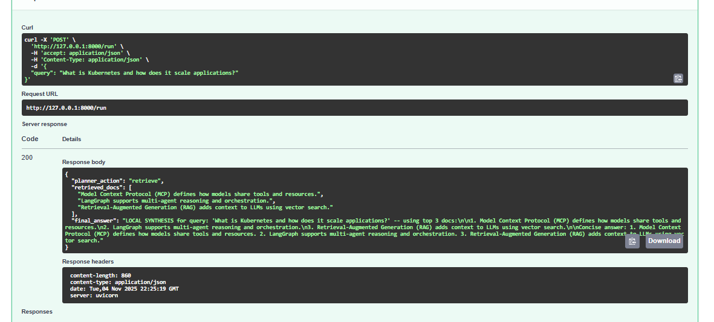
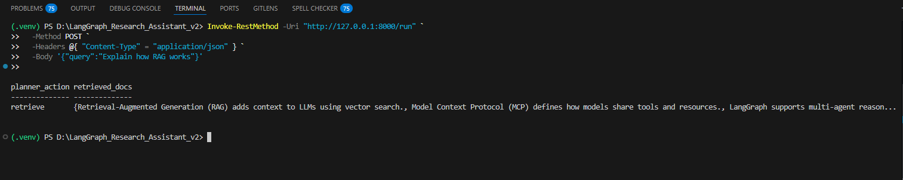
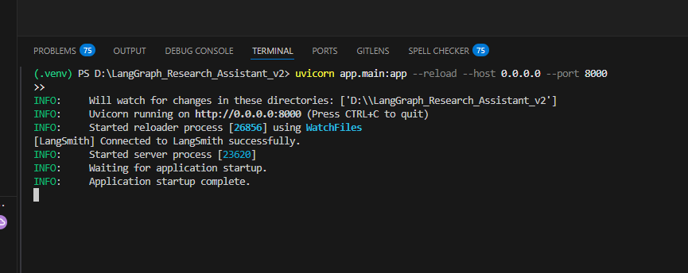
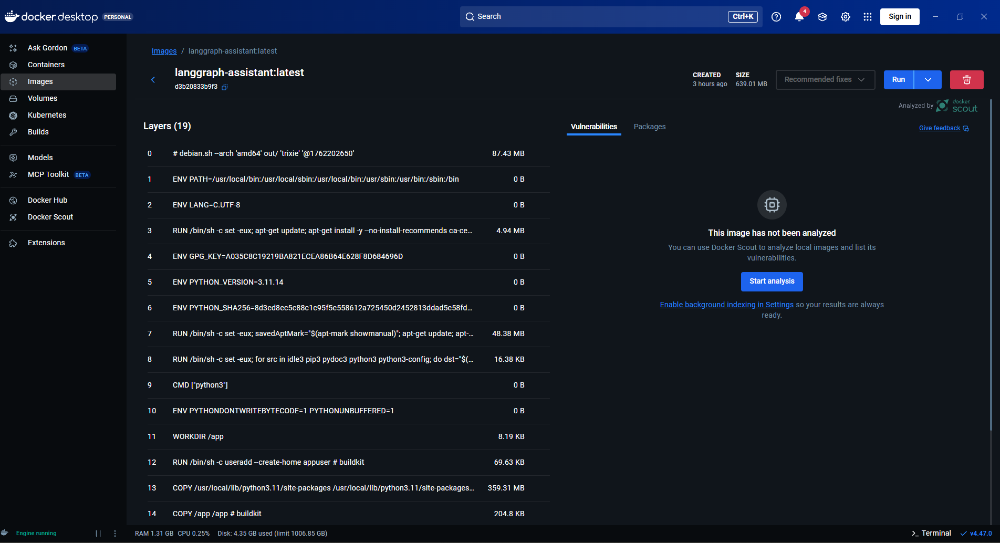
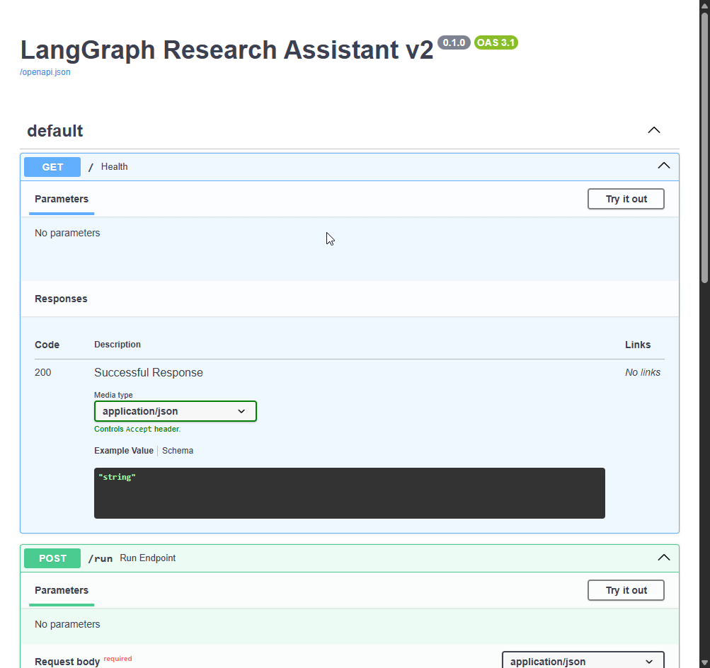

# 🤖 LangGraph Research Assistant

A **multi-agent RAG (Retrieval-Augmented Generation)** system built using **LangGraph**, **LangChain**, and **LangSmith**, designed to simulate how intelligent AI agents retrieve, reason, and synthesize knowledge collaboratively.

> This project demonstrates a full local RAG pipeline — **no external OpenAI API required** — with FAISS vector search, multi-agent orchestration, LangSmith tracing, and Docker deployment.

---

## 🚀 Features

- 🧠 **LangGraph Multi-Agent Orchestration**  
  Modular design with planner, retriever, and synthesizer agents.
  
- 📚 **RAG (Retrieval-Augmented Generation)**  
  Retrieves relevant documents using FAISS before synthesizing answers.

- 🔍 **FAISS Vectorstore**  
  Handles efficient document indexing and semantic similarity search.

- 📈 **LangSmith Integration**  
  Traces and monitors agent events and execution flow.

- 🐳 **Dockerized Setup**  
  Fully containerized — deploy anywhere.

- 🧩 **Local LLM Fallback**  
  When OpenAI API is unavailable, a deterministic synthesizer generates context-based answers locally.

---

## 🏗️ Architecture Overview

```
User Query
│
▼
[ Planner Agent ]
│
▼
[ Retriever Agent ] → Fetches top-k context documents (via FAISS)
│
▼
[ Synthesizer Agent ] → Generates context-based final answer
│
▼
Response returned to FastAPI endpoint (/run)
```

---

## 🧪 Tech Stack

| Layer | Tool / Library | Description |
|-------|----------------|--------------|
| Framework | **FastAPI** | Backend API layer |
| Orchestration | **LangGraph** | Multi-agent workflow |
| Retrieval | **FAISS + LangChain** | Vector similarity search |
| Embeddings | **Local Sentence Embeddings / OpenAI (optional)** | Document encoding |
| Monitoring | **LangSmith** | Event tracing and pipeline visualization |
| Containerization | **Docker** | Build and deployment |

---

## ⚙️ Installation & Setup

### 1️⃣ Clone the repository

```bash
git clone https://github.com/GEEGEEGOOGOO/LangGraph-Research-Assistant.git
cd LangGraph-Research-Assistant
```

### 2️⃣ Create and activate virtual environment

```bash
python -m venv .venv
.\.venv\Scripts\activate   # Windows
source .venv/bin/activate  # macOS/Linux
```

### 3️⃣ Install dependencies

```bash
pip install -r requirements.txt
```

### 4️⃣ Build Vectorstore (FAISS)

```bash
python -m app.vectorstore
```

Expected output:

```
[SUCCESS] FAISS index saved at ./data/faiss_index
```

### 5️⃣ Run the FastAPI Server

```bash
uvicorn app.main:app --reload --host 0.0.0.0 --port 8000
```

When you see:

```
INFO: Application startup complete.
```

your server is running at 👉 [http://127.0.0.1:8000/docs](http://127.0.0.1:8000/docs)

---

## 🧠 Example Queries (Swagger UI)

**Endpoint:** `POST /run`

Example request:

```json
{
  "query": "Explain how RAG works"
}
```

Example response:

```json
{
  "planner_action": "retrieve",
  "retrieved_docs": [
    "Retrieval-Augmented Generation (RAG) adds context to LLMs using vector search.",
    "Model Context Protocol (MCP) defines how models share tools and resources.",
    "LangGraph supports multi-agent reasoning and orchestration."
  ],
  "final_answer": "LOCAL SYNTHESIS for query: 'Explain how RAG works' ..."
}
```

---

## 🧩 Project Structure

```
LangGraph_Research_Assistant_v2/
├── app/
│   ├── agents/
│   │   ├── planner.py
│   │   ├── retriever.py
│   │   ├── synthesizer.py
│   ├── graph.py
│   ├── main.py
│   ├── config.py
│   ├── vectorstore.py
│   └── embeddings.py
├── data/
│   └── faiss_index/
├── tests/
│   ├── test_pipeline.py
│   ├── test_retriever.py
│   ├── test_synthesizer.py
│   └── test_planner.py
├── Dockerfile
├── requirements.txt
└── README.md
```

---

## 🐳 Docker Deployment

Build and run your containerized assistant:

```bash
docker build -t langgraph-assistant:latest .
docker run -p 8000:8000 langgraph-assistant:latest
```

---

## 🧩 Demo

### 🔹 Swagger UI Screenshot



### 🔹 Terminal Output (FAISS Index)



### 🔹 Server Running



### 🔹 Docker File



### 🔹 API Demo GIF



---

## 🧠 Key Learning Outcomes

* Implemented **LangGraph** for multi-agent reasoning.
* Designed a **Retrieval-Augmented Generation** pipeline.
* Integrated **LangSmith** for workflow tracing.
* Built deterministic **local fallback synthesis** (no API required).
* Deployed the entire workflow using **Docker**.

---

## 🎯 Ideal For

* **AIML Internship applications**
* **LangGraph & RAG architecture understanding**
* **Demonstrating full AI pipeline engineering**

---

## 📄 License

MIT License © 2025 — Created by **[Shashank Kumar]**

---

## 📬 Contact

Feel free to reach out for questions or collaboration opportunities!

- **GitHub:** [@GEEGEEGOOGOO](https://github.com/GEEGEEGOOGOO)
- **Email:** shashank181002@gmail.com
- **LinkedIn:** [MyProfile](https://linkedin.com/in/shashank1810)
